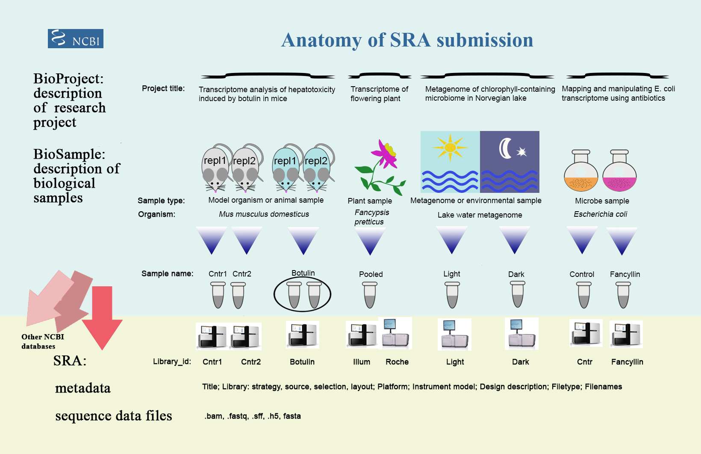

Class 8 – Data download and genome comparison
=============================================

Goal
----

- In this class, we will learn about NCBI public database and how to download entire datasets pertianing to a research study using SRAtoolkit.
- We will then apply the QC skills that we learned in our previous class such as FastQC and MultiQC to assess the downloaded dataset. (Need to decide if we are going this route)
- We will then do a quick genomic comparison of the downloaded dataset using Mashtree. 

### Databases hosted by NCBI



The National Center for Biotechnology Information (NCBI) provides bioinformatics tools and hosts approximately 40 online literature and molecular biology databases. Some of the most used and popular databases are PubMed, Genbank, SRA etc. MOst of the NCBI databases are linked together through unique accession numbers and therfore provide a comprehensive resource for biomedical research. For this class, we will focusing on SRA - Sequence read archive database which is the largest publicly available repository of high throughput raw sequencing and alignment data. 

SRA can be searched independently, or SRA records associated with a specific BioProject or BioSample accessions are linked from their respective records.

Each SRA record is given a unique accession number based on the source database (SRA, European Bioinformatics Institute (EBI), or DNA Data Bank of Japan (DDBJ)), and the type of record (Study, Sample, Experiment, Run):

- Study (e.g., the SRA record associated with a specific BioProject): SRP#, ERP#, or DRP#
- Sample (e.g.,the SRA record associated with a specific BioSample): SRS#, ERS#, or DRS#
- Experiment (e.g., the SRA record for a specific experiment or run(s)): SRX#, ERX#, or DRX#
- Run (e.g., the SRA record for a specific run): SRR#, ERR#, or DRR#

A BioProject is a collection of biological data related to a large-scale research effort such as genome sequencing, epigenomic analyses, genome-wide association studies (GWAS) and variation analyses. it provides a single place to find links to the diverse data types generated for that research project. Whereas, The BioSample database contains descriptions of biological source materials used in experimental assays.


Download datasets from NCBI using SRA toolkit
------------------------------------------------

Lets start an interactive session to start the download of the subset of data.

```
islurm

wd

mkdir class8

cd class8/

#Create condo environment and install SRA toolkit, mashtree
conda create -n class8 -c bioconda sra-tools mashtree

conda activate class8

fasterq-dump -h

mashtree -h

# Use this or just provide them with the SRA accessions. Whichever makes it less confusing. 
# Esearch/Esummary/Xtract can be a little intimidating at first.
# Lets keep it simple and just provide them with the 3o SRA accession from PRJEB2111 stucy.
# esearch -db sra -query PRJEB2111 | esummary | xtract -pattern DocumentSummary -element Experiment@acc,Run@acc,Platform@instrument_model,Sample@acc | head -n30 > PRJEB2111-info_30_samples.tsv

for accession in $(cut -f2 PRJEB2111-info_30_samples.tsv); do printf "\n  Working on: ${accession}\n\n"; fasterq-dump ${accession};  done

Or

cut -f2 PRJEB2111-info_30_samples.tsv | parallel fasterq-dump {}
# The parallel command will finish in 7m12.465s so this is a better option if we decide to run in class. Can make it fast if we run more cores on islurm.

ls
```

Compare genomes using Mashtree
------------------------------

```
islurm

#Fastest way to get the Mashtree
time mashtree --numcpus 8 *.fastq --outtree mashtree_faster.dnd --outmatrix mashtree_faster.tsv

#real	6m49.139s
#user	6m32.699s
#sys	0m12.186s

```

