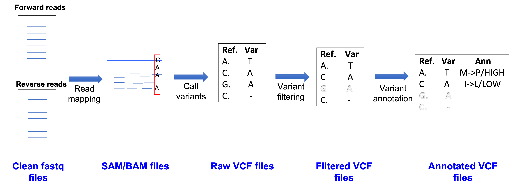
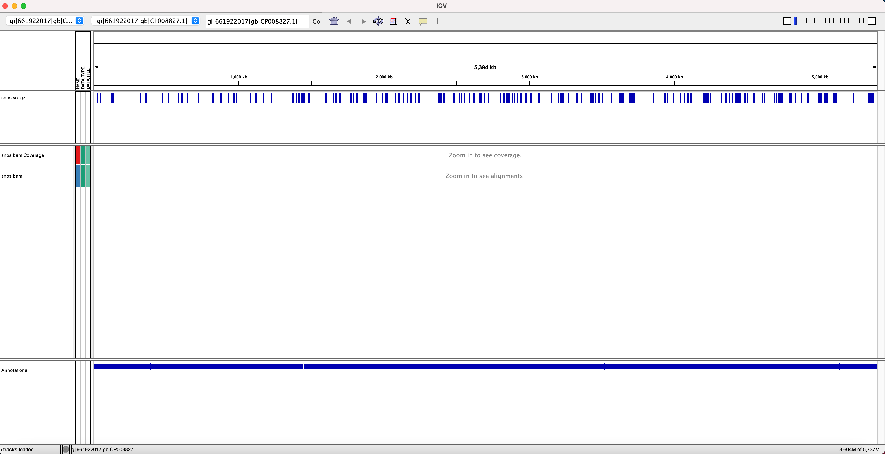
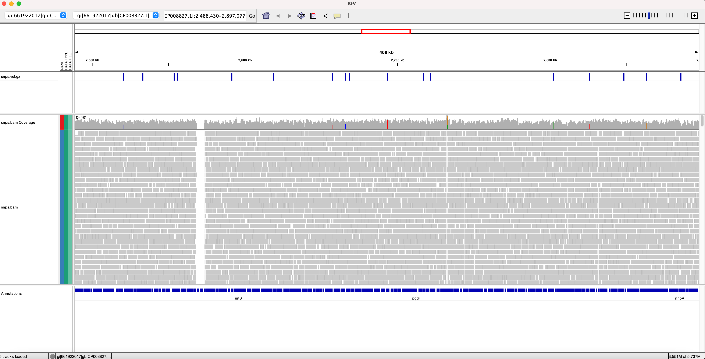
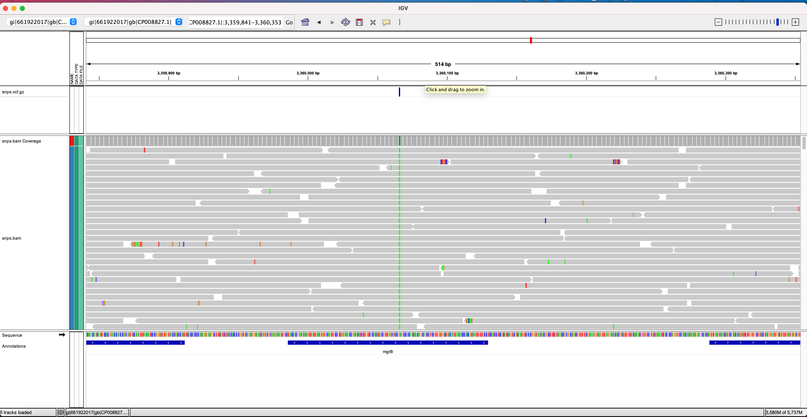
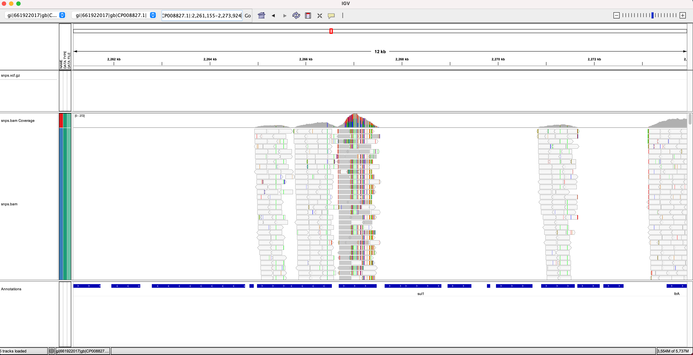

Class 9 – Reference based variant calling
=============================================

Goal
----

- In this class, we will run Snippy which is a microbial variant calling pipeline on a sample to identify an antibiotic resistance mutation in our sequenced genome
- Look at various outputs of Snippy to explore these variants and learn what they mean.
- Visualize these variants in IGV which is a great visualization tool to put the variant calling steps in perspective.


Applications of variant identification:
--------------------------------------
One of the most common goals of in sequencing a microbial genome is to identify small genetic variants like nucleotide substitutions or small insertions/deletions (i.e. indels). Identifying these genetic variants in one or multiple genomes has several important downstream applications:

1. Phylogenetic analysis - The first step in a phylogenetic analysis is identification of single nucleotide variants (SNVs) across the set of genomes of interest. Essentially, the input to any phylogenetic tree building software is a variant alignment that indicates what nucleotide each genome has at a position that is variable in at least one of the input genomes. The resulting phylogenetic tree then groups genomes together based on shared evolution, which is inferred from shared variants.

2. Transmission analysis - One of the most common approaches to assess the confidence in a putative transmission linkage between two individuals is to count the number of variants between two individuals pathogen genomes. Thus, having accurate variants is essential to making correct transmission inferences.

3. Functional analysis - In previous sessions we identified different types of genetic variation including differences in gene content and antibiotic resistance variation. Small changes in the genome like those identified through variant calling pipelines can also have significant functional impacts on genome function.

Overview of variant calling pipelines:
-------------------------------------
A typical variant calling analysis involves:
- ***Read Mapping:*** Mapping sequenced reads to the reference genome using a read mapper
- ***Variant calling:*** Calling variants(differences) between the reference genome and our sample.
- ***Variant filtering:*** Filtering out variant calls that are deemed low confidence based on user defined criteria.
- ***Variant annotation:*** Annnotating these variants to learn about their their effect on proteins and other biological processes.

Here is a visual representation of these steps:



Variant calling Pipeline:
-------------------------

***Read Mapping:***

Read Mapping is a time-consuming step that involves searching the reference and finding the optimal location for the alignment for millions of reads. Creating an index file of a reference sequence for quick lookup/search operations significantly decreases the time required for read alignment. Imagine indexing a genome sequence like the index at the end of a book. If you want to know on which page a word appears or a chapter begins, it is much more efficient to look it up in a pre-built index than going through every page of the book. Similarly, an index of a large DNA sequence allows aligners to rapidly find shorter sequences embedded within it. 

Note: each read mapper has its own unique way of indexing a reference genome and therefore the reference index created by BWA cannot be used for Bowtie. (Most Bioinformatics tools nowadays require some kind of indexing or reference database creation)

One we have prepared the reference genome for alignment, clean reads (typically an output from Trimmomatic) are mapped against the reference genome using [BWA](http://bio-bwa.sourceforge.net/bwa.shtml "BWA manual"), bowtie or any other short read mapper of choice. Choosing the right read mapper is crucial and should be based on the type of analysis and data you are working with. Each aligners are meant to be better used with specific types of data, for example:

For whole genome or whole exome sequencing data: Use BWA for long reads (> 50/100 bp), use Bowtie2 for short reads (< 50/100bp)
For transcriptomic data (RNA-Seq): use Splice-aware Mapper such as Tophat. (Not applicable for microbial data)


The output of BWA and most of the short-reads aligners is a SAM file. SAM format is considered as the standard output for most read aligners and stands for Sequence Alignment/Map format. It is a TAB-delimited format that describes how each reads were aligned to the reference sequence. Detailed information about the SAM specs can be obtained from this [pdf](https://www.google.com/url?sa=t&rct=j&q=&esrc=s&source=web&cd=1&ved=0ahUKEwizkvfAk9rLAhXrm4MKHVXxC9kQFggdMAA&url=https%3A%2F%2Fsamtools.github.io%2Fhts-specs%2FSAMv1.pdf&usg=AFQjCNHFmjxTXKnxYqN0WpIFjZNylwPm0Q) document.

***BAM Post-processing and duplicate removal:***

TH output of any read mapping step is a file called SAM file which stands for Sequence Alignment/Map format. The next step involves converting this SAM files generated by the aligner using [Samtools](http://www.htslib.org/doc/samtools.html "Samtools Manual") into a binary format. BAM is a compressed binary equivalent of SAM but are usually quite smaller in size than SAM format. Since, parsing through a SAM format is slow, Most of the downstream tools require SAM file to be converted to BAM so that it can be easily sorted and indexed.

SamtoBAM is followed by PCR optical duplicate removal step. This step will mark duplicates(PCR optical duplicates) and remove them using [PICARD](http://broadinstitute.github.io/picard/command-line-overview.html#MarkDuplicates "Picard MarkDuplicates")

Illumina sequencing involves PCR amplification of adapter ligated DNA fragments so that we have enough starting material for sequencing. Therefore, some amount of duplicates are inevitable. Ideally, you amplify upto ~65 fold(4% reads) but higher rates of PCR duplicates e.g. 30% arise when people have too little starting material such that greater amplification of the library is needed or some smaller fragments which are easier to PCR amplify, end up over-represented.

For an in-depth explanation about how PCR duplicates arise in sequencing, please refer to this interesting [blog](http://www.cureffi.org/2012/12/11/how-pcr-duplicates-arise-in-next-generation-sequencing/)

Picard identifies duplicates by searching reads that have same start position on reference or in PE reads same start for both ends. It will choose a representative from each group of duplicate reads based on best base quality scores and other criteria and retain it while removing other duplicates. This step plays a significant role in removing false positive variant calls (such as sequencing error) during variant calling that are represented by PCR duplicate reads.


***Variant calling***

One of the downstream uses of read mapping is finding differences between our sequence data against a reference. This step is achieved by carrying out variant calling using any of the variant callers (samtools, gatk, freebayes etc). Each variant caller uses a different statistical framework to discover SNPs and other types of mutations. For those of you who are interested in finding out more about the statistics involved, please refer to [this]() samtools paper, one of most commonly used variant callers.

The [GATK best practices guide](https://www.broadinstitute.org/gatk/guide/best-practices.php) will provide more details about various steps that you can incorporate in your analysis.

There are many published articles that compare different variant callers but this is a very interesting [blog post](https://bcbio.wordpress.com/2013/10/21/updated-comparison-of-variant-detection-methods-ensemble-freebayes-and-minimal-bam-preparation-pipelines/) that compares the performance and accuracy of different variant callers.

***Variant Filtration***

This step will filter variants and process file generation using [GATK](https://www.broadinstitute.org/gatk/guide/tooldocs/org_broadinstitute_gatk_tools_walkers_filters_VariantFiltration.php "GATK Variant Filteration"):

There are various tools that can you can try for variant filteration such as vcftools, GATK, vcfutils etc. Common criteria used to filter variants include:
1. The number of mapped reads supporting a variant
2. The quality of mapping of the reads underlying the variant
3. The consistency of the variant across all reads mapping to a given position

***Caveat: This filter criteria should be applied carefully after giving some thought to the type of library, coverage, average mapping quality, type of analysis and other such requirements.***


***Variant Annotation***


Variant annotation is critical for applications where one hopes to identify variants having a potential functional impact on the genome. Most of the variant annotation tools create their own database or use an external one to assign function and predict the effect of variants on genes.


Variant calling using SNIPPY
----------------------------

A typical Bioinformatics variant calling pipeline stitches the steps described above together so that we dont have to run each of the individual commands seperately on hundreds of samples. 

For today's class, we will run a variant calling pipeline called [Snippy](https://github.com/tseemann/snippy) that will run all of these intermediate steps taking clean reads as input and outputting a filtered annotated variants in various file formats that we will then explore in IGV. Note that while today we are running Snippy to identify variants in a single genome, it can be run on a set of sequenced genomes, which we will do in future sessions for phylogenetic and transmission analysis.

Lets install Snippy with conda and create a new environment.

```
module load python3.9-anaconda/2021.11

conda create -n class9snippy -c conda-forge -c bioconda -c defaults snippy

conda activate class9snippy

snippy --check
```

If the snippy check works fine, you are all set to run your first sequence analysis pipeline.

Now, copy over class9 data which contains clean fastq reads for sample PCMP_H326 and run Snippy pipeline on it

```
wd

cp -r ../shared_data/data/class9/ ./

cd class9

ls
```

You should see a genbank file for the reference genome KPNIH1, clean forward and reverse reads for PCMP_H326 and a slurm script with snippy commands in it.

Lets edit the snippy.sbat file and submit it as a job.

```
sbatch snippy.sbat

```

It should take around 4 minutes to finish the job.

Lets go through some of the important output files that Snippy generates. The output file description can be found at [Snippy's github website](https://github.com/tseemann/snippy/blob/master/README.md#output-files)

Lets go through some of these files.

```
cd PCMP_H326/
```

***snps.txt*** will contain the overall statistics of number of different types of SNP's that were called by Snippy.

```
less snps.txt
```

Lets explore the final vcf file generated by the pipeline:

```
less snps.vcf
```

***snps.vcf*** contains the final filtered annotated variants in VCF format.

VCF is a text file format that contains meta-information lines, a header line starting with a pound sign. 

For example - line "##INFO=<ID=DP,Number=1,Type=Integer,Description="Total read depth at the locus">" in the file describes that DP stands for number of reads supporting a variant. 

The column data lines contains information about the variant position in the genome. 

The annotation step add an extra field named 'ANN' at the end of INFO field. Lets go through the ANN field added after annotation step. THis ANN field will provide information such as the impact of variants (HIGH/LOW/MODERATE/MODIFIER) on genes and transcripts along with other useful annotations.

Detailed information of the ANN field and sequence ontology terms that it uses can be found [here](https://pcingola.github.io/SnpEff/).

Let's now use some Unix commands to explore our file and extract some useful information. First, it would be nice to see how many MODIFIER (non-coding), LOW (synonymous), MODERATE (non-synonymous) AND HIGH IMPACT (frameshift/stop) variants there are. First, let's see which column has the annotation info:

```
grep "CHROM" snps.filt.vcf | tr "\t" "\n" | cat -n
```

Next, let's see which entry in the annotation contains information on the impact of the variant:

```
grep -v "#" snps.vcf | cut -f 8 | head -n +1 | tr "\|" "\n" | cat -n
```

Finally, let's count them!

```
grep -v "#" snps.vcf | cut -f 8 | cut -d"|" -f 3 | sort | uniq -c
```

You can see that most variants are LOW (synonymous) or MODERATE (non-synonymous). Let's now extract the positions of high impact variants so we can pull them out of the more nicely formatted annotation files.

```
grep HIGH snps.vcf |cut -f 2 > high_impact_pos
```

Finally, let's pull out the genes that these high impact mutations are in

```
grep -f high_impact_pos snps.tab | cut -f 14
```

You can see that of the 13 high impact mutations, one is in mgrB, which is one of our genes known to be involved in colistin resistance.


Visualize BAM and VCF files in [IGV](http://software.broadinstitute.org/software/igv/) (Integrative Genome Viewer)
------------------------------------------------------------------------------------------------------------------

Visualization of all of these various output files can help in making some significant decisions and inferences about your entire analysis. There are a wide variety of visualization tools out there that you can choose from for this purpose.

We will be using [IGV](http://software.broadinstitute.org/software/igv/) (Integrative Genome Viewer) here, developed by the Broad Institute for viewing BAM and VCF files for manual inspection of some of the variants.

Copy these files over to your desktop and start IGV to load them.

- ***Required Input files:***

> - KPNIH1.gbk
> - snps.bam
> - snps.bam.bai
> - snps.vcf.gz
> - snps.vcf.gz.csi


Start IGV.

Load the following files (each is a separate panel or 'track'):
- `Genomes` &rarr; `Load Genome from File` &rarr; navigate to `IGV_files` &rarr; `KPNIH1.gbk`
  - Shows what genes are present (looks like a blue bar when zoomed out)
- `File` &rarr; `Load from File` &rarr; navigate to `IGV_files` &rarr; `snps.vcf.gz`
  - Shows variants found in the sample (when you zoom in)
- `File` &rarr; `Load from File` &rarr; navigate to `IGV_files` &rarr; `snps.bam`
  - Shows coverage and reads aligned to the reference (when you zoom in)
  
By default, the whole genome is shown:


  
Using the plus sign in the top right corner of the window, zoom in by clicking 5 times
- You should see blue bars in the vcf track and red bars in the fastq track, both showing positions with a variant.
- You can hover over the bars to get more information about the variant.

- You should also see coverage and reads mapped in bottom half of the window
  - Different colors indicate different variants
  - In the Coverage track, the y-axis indicates read coverage
  - You can now also see distinct genes in the genbank annotation track
  - You can hover over a read to get more information about it
  

  
To see all of the reads, you can click the square with the arrows pointing to each corner, found in the top-middle-right of the window:


Now that you know the basics of how to use IGV, let's navigate to the mgrB gene to look at mutations that might make this sample resistant to colistin. 
- In the top middle bar of the window, type in gi|661922017|gb|CP008827.1|:3,359,811-3,360,323
- Look at the gene annotation by hovering over the blue bar to see what gene it is
- What is the nucleotide of the SNP in the sample? The amino acid change? 
- Do you think this variant might be the cause of colistin resistance? Why or why not?



Now let's look an example of a heterozygous variant - variant positions where more than one allele (variant) with sufficiently high read depth are observed. 
- Navigate to gi|661922017|gb|CP008827.1|:2,261,155-2,273,924
- You can see that there are a lot of heterozygous variants in one region. 
  - Snippy removes these types of variants during the Variant Filteration step using the mapqual and basequal values. If you zoomed in on the alignments at these positions, you will find that the mapper greedily tried to map these reads and therfore contains high number of variants. This in turn lowers down the alignment and base quality values of the variant positions.
- In the region with lots of heterozygous variants, the read coverage is much higher than in the flanking regions (the regions on either side), and much higher than the rest of the genome coverage. 
- Why do you think this region contains many heterozygous variants and a higher read coverage than the rest of the genome?
- You can also see that there are some places with no reads and no coverage. What does this mean?



You can refer to the [IGV User Guide](http://software.broadinstitute.org/software/igv/userguide) for more information about how to use IGV. 

