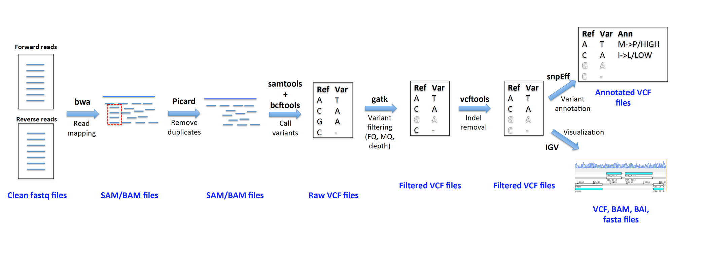
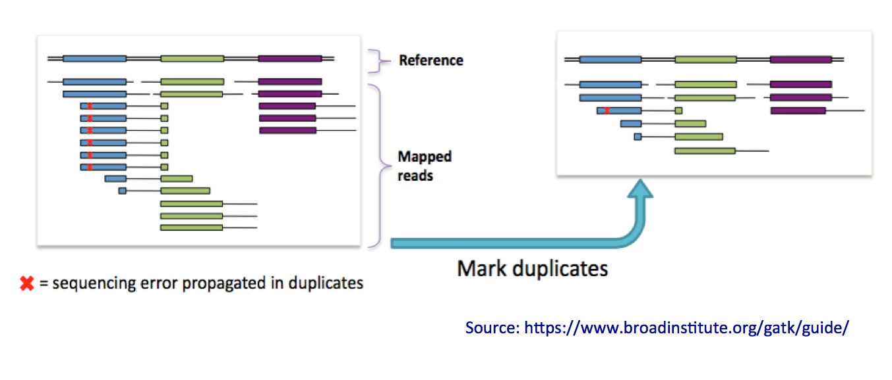
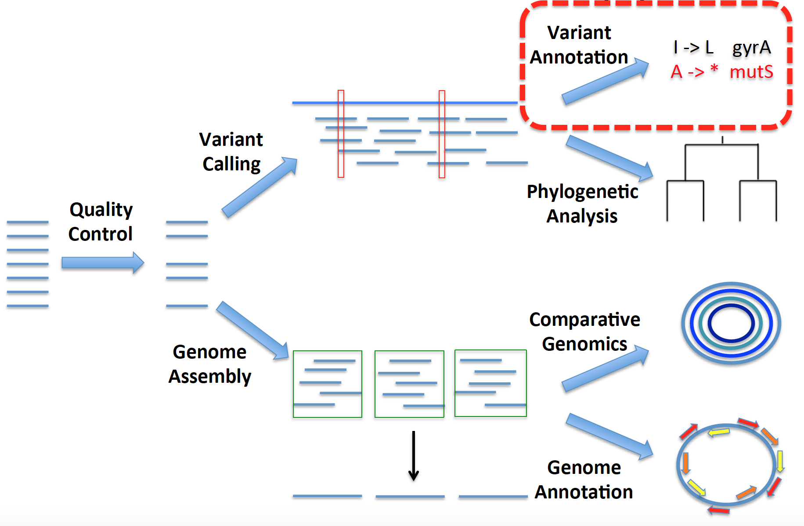

Class 9 – Reference based variant calling
=============================================

Goal
----

- In this class, we will run Snippy which is a microbial variant calling pipeline on a sample to find out the difference between our sample and the reference genome.
- Look at various outputs of Snippy to explore these variants and learn what they mean.
- Visualize these variants in IGV which is a great visualization tool to put the variant calling steps in perspective.

At the start of this course, we performed some quality control steps on our sequencing data to make it clean and usable for various downstream analysis. One of the downstream sequence analysis involves finding out the differences between the sequences sample reads and the reference genome. The downstream sequence analysis involves various steps and tools that are used to transform one file into another while also extracting useful information.

A typical variant calling analysis requires:
- Indexing: Preparing your reference genome for alignments.
- Read Mapping: mapping sequenced reads to the reference genome using a read mapper
- Post-processing alignments: converting alignment formats to a binary format.
- Varuiant calling: calling variants/differences between the reference genome and our sample using variant callers
- Variant annotation: annotating these variants to learn their effects 

Here is a visual representation of these steps:

***Indexing and Read Mapping:***

Clean reads are mapped against a finished reference genome using [BWA](http://bio-bwa.sourceforge.net/bwa.shtml "BWA manual"), bowtie or any other short read mapper of choice. Choosing the right read mapper is crucial and should be based on the type of analysis and data you are working with. Each aligners are meant to be better used with specific types of data, for example:

For whole genome or whole exome sequencing data: Use BWA for long reads (> 50/100 bp), use Bowtie2 for short reads (< 50/100bp)
For transcriptomic data (RNA-Seq): use Splice-aware Mapper such as Tophat. (Not applicable for microbial data)

Read Mapping is a time-consuming step that involves searching the reference and finding the optimal location for the alignment for millions of reads. Creating an index file of a reference sequence for quick lookup/search operations significantly decreases the time required for read alignment. Imagine indexing a genome sequence like the index at the end of a book. If you want to know on which page a word appears or a chapter begins, it is much more efficient to look it up in a pre-built index than going through every page of the book. Similarly, an index of a large DNA sequence allows aligners to rapidly find shorter sequences embedded within it. 

Note: each read mapper has its own unique way of indexing a reference genome and therefore the reference index created by BWA cannot be used for Bowtie. (Most Bioinformatics tools nowadays require some kind of indexing or reference database creation)

The output of BWA and most of the short-reads aligners is a SAM file. SAM format is considered as the standard output for most read aligners and stands for Sequence Alignment/Map format. It is a TAB-delimited format that describes how each reads were aligned to the reference sequence. Detailed information about the SAM specs can be obtained from this [pdf](https://www.google.com/url?sa=t&rct=j&q=&esrc=s&source=web&cd=1&ved=0ahUKEwizkvfAk9rLAhXrm4MKHVXxC9kQFggdMAA&url=https%3A%2F%2Fsamtools.github.io%2Fhts-specs%2FSAMv1.pdf&usg=AFQjCNHFmjxTXKnxYqN0WpIFjZNylwPm0Q) document.

***BAM Post-processing and duplicate removal:***

The next step involves manipulating the SAM files generated by the BWA aligner using [Samtools](http://www.htslib.org/doc/samtools.html "Samtools Manual")

BAM is the compressed binary equivalent of SAM but are usually quite smaller in size than SAM format. Since, parsing through a SAM format is slow, Most of the downstream tools require SAM file to be converted to BAM so that it can be easily sorted and indexed.

THis Sam to BAM conversion can be performed in two steps: The first section for this step will ask samtools to convert SAM format(-S) to BAM format(-b). The next section will sort these converted BAM file using SAMTOOLS

SamtoBAM is followed by PCR optical duplicate removal step. This step will mark duplicates(PCR optical duplicates) and remove them using [PICARD](http://broadinstitute.github.io/picard/command-line-overview.html#MarkDuplicates "Picard MarkDuplicates")

Illumina sequencing involves PCR amplification of adapter ligated DNA fragments so that we have enough starting material for sequencing. Therefore, some amount of duplicates are inevitable. Ideally, you amplify upto ~65 fold(4% reads) but higher rates of PCR duplicates e.g. 30% arise when people have too little starting material such that greater amplification of the library is needed or some smaller fragments which are easier to PCR amplify, end up over-represented.

For an in-depth explanation about how PCR duplicates arise in sequencing, please refer to this interesting [blog](http://www.cureffi.org/2012/12/11/how-pcr-duplicates-arise-in-next-generation-sequencing/)

Picard identifies duplicates by searching reads that have same start position on reference or in PE reads same start for both ends. It will choose a representative from each group of duplicate reads based on best base quality scores and other criteria and retain it while removing other duplicates. This step plays a significant role in removing false positive variant calls(such as sequencing error) during variant calling that are represented by PCR duplicate reads.

To remove PCR duplicate reads from BAM file, PICARD needs a sequence dictionary of reference fasta file which can be generated with picard CreateSequenceDictionary command. Once the sequence dictionary is created, PICARD can be run for removing duplicates

The output of Picard remove duplicate step is a new bam file without PCR duplicates. Most of the downstream tools such as GATK requires your BAM file to be indexed and sorted by reference genome positions. Therefore, this bam file should be indexed before it can be used for variant calling.

***Variant calling***

One of the downstream uses of read mapping is finding differences between our sequence data against a reference. This step is achieved by carrying out variant calling using any of the variant callers (samtools, gatk, freebayes etc). Each variant caller uses a different statistical framework to discover SNPs and other types of mutations. For those of you who are interested in finding out more about the statistics involved, please refer to [this]() samtools paper, one of most commonly used variant callers.

The [GATK best practices guide](https://www.broadinstitute.org/gatk/guide/best-practices.php) will provide more details about various steps that you can incorporate in your analysis.

There are many published articles that compare different variant callers but this is a very interesting [blog post](https://bcbio.wordpress.com/2013/10/21/updated-comparison-of-variant-detection-methods-ensemble-freebayes-and-minimal-bam-preparation-pipelines/) that compares the performance and accuracy of different variant callers.

Here we will use samtools mpileup to perform this operation on our BAM file and generate a VCF (variant call format) file. 

This step will Call variants using [samtools](http://www.htslib.org/doc/samtools.html "samtools manual") mpileup and [bcftools](https://samtools.github.io/bcftools/bcftools.html "bcftools")**

***Variant Filteration***

This step will filter variants and process file generation using [GATK](https://www.broadinstitute.org/gatk/guide/tooldocs/org_broadinstitute_gatk_tools_walkers_filters_VariantFiltration.php "GATK Variant Filteration"):

There are various tools that can you can try for variant filteration such as vcftools, GATK, vcfutils etc. 

***Caveat: This filter criteria should be applied carefully after giving some thought to the type of library, coverage, average mapping quality, type of analysis and other such requirements.***

***Variant Annotation***

Variant annotation is one of the crucial steps in any variant calling pipeline. Most of the variant annotation tools create their own database or use an external one to assign function and predict the effect of variants on genes. We will try to touch base on some basic steps of annotating variants in our vcf file using snpEff. 

You can annotate these variants before performing any filtering steps that we did earlier or you can decide to annotate just the final filtered variants. 

snpEff contains a database of about 20,000 reference genomes built from trusted and public sources. Lets check if snpEff contains a database of our reference genome.
